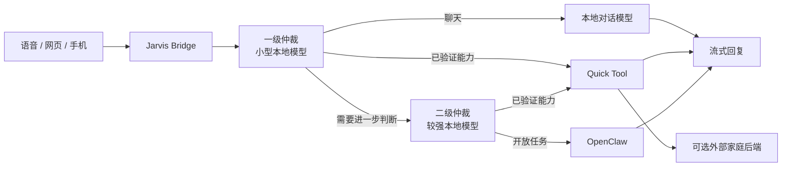

<h1 align="center">Jarvis Home</h1>

<p align="center">
  <strong>让 AI 不只停在聊天框里，而是在你自己的设备上，成为真正住在家里的智能管家。</strong>
</p>

<p align="center">
  本地优先 · 分层仲裁 · 可审计能力 · 开放集成
</p>

<p align="center">
  <a href="LICENSE"></a>
  </a>
  
  
</p>

<p align="center">
  <a href="#先体验一下">快速体验</a> ·
  <a href="docs/architecture.md">架构</a> ·
  <a href="#现在做到哪了">路线图</a> ·
  <a href="CONTRIBUTING.md">参与开发</a> ·
  <a href="SECURITY.md">安全</a>
</p>

> [!NOTE]
> Jarvis Home 还在早期开发阶段。仓库已经包含可运行的桥接内核、离线 Mock Home、完整测试与构建流程，但还不是面向普通用户的一键安装产品。

## 为什么做 Jarvis Home

今天的 AI 很会聊天，但离“家里的智能管家”还有一段距离。

它需要听懂一句随口说出的话，判断这是聊天、查询还是操作；需要知道什么时候本地模型就能完成，什么时候应该交给更强的 Agent；需要接入音箱、网页、手机和家庭设备，同时又不能把模型的一次误判直接变成危险操作。

更重要的是，这套系统应该属于使用者自己。模型可以更换，界面可以更换，家庭后端也可以更换。对话、能力和状态不应被锁死在某一家云服务里。

Jarvis Home 想做的，就是中间这一层：

- 接住来自语音、网页或其他客户端的请求；
- 用小模型快速判断，再按需升级到更强的执行者；
- 把常用能力收敛为经过验证的 Quick Tools；
- 把开放任务交给 OpenClaw，而不是让小模型假装什么都会；
- 记录能力版本、执行结果和评审证据，让系统的变化可回看、可回滚。

它不是一个新的大模型，也不是某个智能家居平台的外壳。它是一套让本地 AI、Agent 和家庭服务能够安全协作的运行内核。

## 它是怎样工作的

一次请求只会有一个最终执行者。



### 分层大脑

一级仲裁只做三件事：本地聊天、选择已获准的 Quick Tool，或把请求交给二级仲裁。二级仲裁仍然优先选择受控能力，无法安全收敛的任务才交给 OpenClaw。

这样可以让简单请求更快，也避免每句话都启动完整 Agent。

### Quick Tools

Quick Tool 不是一段任由模型发挥的提示词，而是带版本、权限、风险等级和验证记录的能力包。

模型只能选择目录中的设备、场景和语义操作。设备 ID、可写属性和实际命令由适配器提供，不能由模型凭空生成。Quick Tool 执行失败时也不会自动升级到权限更大的执行者。

### OpenClaw

OpenClaw 负责开放式规划和复杂工具任务。Jarvis Home 负责判断何时交接、保存过程状态，并把结果送回原来的会话。

OpenClaw 是外部运行时，不随本仓库一起打包。

### 形象与交互

Jarvis Home 不限定前端形态。它可以接在音箱、网页、手机应用或桌面角色后面。

未来可以让 [AIRI](https://github.com/moeru-ai/airi) 作为 Jarvis 的 VRM / Live2D 形象和语音表现层。AIRI 负责“看起来和听起来是什么样”，Jarvis Home 继续负责对话路由、能力、工具和会话。两者通过开放接口连接，不互相绑死。

## 现在已经有什么

### 已完成

- [x] OpenAI 兼容的聊天接口
- [x] 流式与非流式回复
- [x] 两级本地模型仲裁
- [x] 本地聊天、Quick Tool、OpenClaw 三类执行所有权
- [x] 版本化能力注册表
- [x] 能力验证、晋级、回滚与审计记录
- [x] 设备控制与场景选择的安全规划器
- [x] 默认绑定 `127.0.0.1` 的服务入口
- [x] 无网络、无真实设备副作用的 Mock Home
- [x] 默认关闭的通用外部家庭 HTTP 插件
- [x] 锁定依赖、wheel/sdist 构建和干净 clone 验证
- [x] 发布前隐私与运行数据扫描

### 正在做

- [ ] 面向普通用户的 macOS 安装与服务管理
- [ ] 干净、独立、固定版本的 MiGPT Vue 语音入口 fork
- [ ] 手机端续接同一条 Jarvis 会话
- [ ] AIRI 形象层接入
- [ ] 更多品牌中立的家庭后端适配规范
- [ ] 更完整的能力发现、回放和 Shadow 验证流程
- [ ] 文档站、演示视频和可视化架构图

## 先体验一下

离线 Demo 不连接模型、OpenClaw、摄像头或真实家庭设备。它只在内存里模拟一次开灯操作。

需要 macOS 或 Linux、Python 3.11+ 和 [uv](https://docs.astral.sh/uv/)。

```bash
git clone https://github.com/zhbch1997/JavisHome.git jarvis-home
cd jarvis-home
uv sync --locked --extra test
uv run --locked --extra test jarvis-home-demo
```

预期输出：

```json
{"actions":[{"device_id":"demo-light-1","property":"on","value":true}],"adapter":"mock","status":"ok"}
```

运行诊断和完整测试：

```bash
uv run --locked --extra test python scripts/doctor.py
uv run --locked --extra test bash scripts/test_all.sh
```

## 启动桥接服务

```bash
cp config/.env.example .env.local
# 启动器不会自动读取 .env.local；请显式导出需要的变量。
# 不要提交 .env.local。
set -a
source .env.local
set +a
uv run jarvis-home
```

默认地址：

```text
http://127.0.0.1:18083
```

完整模式需要使用者自行安装并配置本地模型服务和可选的外部运行时。建议先运行离线 Demo，再逐个启用集成。

## 可选集成

| 集成 | 用途 | 分发方式 |
|---|---|---|
| Ollama 兼容服务 | 本地仲裁与聊天模型 | 使用者独立安装 |
| OpenClaw | 开放任务与 Agent 工具 | 使用者独立安装 |
| MiGPT Vue | 音箱与管理界面 | 计划维护独立源码 fork |
| AIRI | VRM / Live2D、语音和桌面表现层 | 外部项目，通过接口连接 |
| 外部家庭 HTTP 后端 | 设备、场景和可选感知能力 | 默认关闭，使用者独立部署 |

### 关于 Miloco

Jarvis Home 不包含、不下载、不安装、不启动、不内嵌或再分发 Miloco、MiMo-VL-Miloco 及其页面、源码、模型和运行数据。

如果使用者已经独立部署了兼容服务，可以手动开启品牌中立的外部家庭 HTTP 插件：

```dotenv
JARVIS_EXTERNAL_HOME_ENABLED=1
JARVIS_EXTERNAL_HOME_BASE_URL=http://127.0.0.1:<port>
```

插件默认关闭。远程地址必须使用 HTTPS，本机回环地址可以使用 HTTP，URL 中不能嵌入凭据。具体边界见 [`integrations/miloco/README.md`](integrations/miloco/README.md)。

## 安全模型

让 AI 控制现实设备，安全边界必须写进代码，而不只是写进提示词。

Jarvis Home 当前遵循这些规则：

- 服务默认只监听回环地址；
- 一次请求只有一个执行所有者；
- 模型输出被视为不可信输入；
- Quick Tool 只能调用注册过的工具；
- 普通本地控制排除门锁、摄像头、音箱、烟雾和燃气设备；
- Quick Tool 失败不会自动获得更高权限；
- 外部后端默认关闭，标识符会编码成单一路径段；
- 运行状态、日志、数据库、媒体、模型和凭据不得进入仓库；
- 发布闸门扫描完整 Git index，而不只扫描本次 diff。

安全问题请阅读 [`SECURITY.md`](SECURITY.md)。架构和信任边界见 [`docs/architecture.md`](docs/architecture.md)。

## 项目结构

```text
jarvis-home/
├── jarvis-bridge/       # 仲裁、路由、能力、执行与反馈内核
├── config/              # 脱敏配置模板
├── integrations/        # 外部项目的接入边界与合规说明
├── docs/                # 架构、许可证和 fork 文档
├── scripts/             # 测试、诊断、发布与干净 clone 验证
└── tests/               # 打包、边界和离线集成测试
```

## 开发

```bash
uv sync --locked --extra test
uv run --locked --extra test bash scripts/test_all.sh
bash scripts/verify_clean_clone.sh
```

`verify_clean_clone.sh` 验证当前已提交的 `HEAD`。它会克隆到临时目录，按锁文件安装依赖，运行测试，构建 wheel/sdist，再从 wheel 运行 Demo。脚本结束后会删除临时目录。

提交前运行：

```bash
python3 scripts/release_guard.py
```

贡献方式和开发约定见 [`CONTRIBUTING.md`](CONTRIBUTING.md)。

## 文档

- [架构与信任边界](docs/architecture.md)
- [MiGPT Vue fork 准备](docs/migpt-vue-fork.md)
- [许可证决策记录](docs/license-decision.md)
- [第三方声明](THIRD_PARTY_NOTICES.md)
- [开源范围](OPEN_SOURCE_SCOPE.md)
- [安全策略](SECURITY.md)

## 项目状态

Jarvis Home 当前是已经公开、经过脱敏和测试的早期开源内核。它可以构建、安装和运行离线 Demo。下一步是完成安全联系方式、首个用户安装流程和更完整的来源复核。

这个仓库不会复制任何私人家庭部署。家庭档案、设备名称、摄像头媒体、模型、凭据、数据库和运行状态都不属于开源项目的一部分。

## License

Jarvis Home 原创代码使用 [MIT License](LICENSE)。第三方项目和资产保留各自的许可条款，详见 [`THIRD_PARTY_NOTICES.md`](THIRD_PARTY_NOTICES.md)。

## 致谢

Jarvis Home 的交互愿景和开放形象层受到 [Project AIRI](https://github.com/moeru-ai/airi) 启发。项目使用、兼容或参考了 FastAPI、HTTPX、Uvicorn、Ollama、OpenClaw 等开源项目的接口设计与工程实践；MiGPT Vue 目前仍是计划中的独立源码 fork，并非本仓库的直接依赖。

第三方名称仅用于说明兼容和集成关系，不代表相关项目对 Jarvis Home 的认可或背书。
