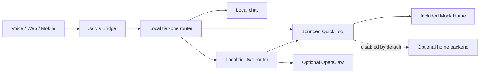
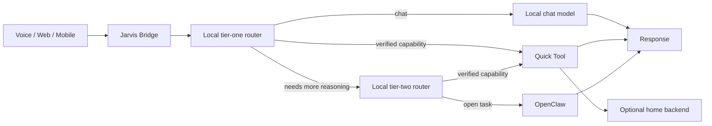

<h1 align="center">Jarvis Home</h1>

<p align="center">
  <strong>A local-first orchestration bridge for voice assistants, AI agents, and smart-home services.</strong>
</p>

<p align="center">
  <a href="README.md">中文</a> ·
  <a href="#quick-start">Quick start</a> ·
  <a href="docs/system-overview.md">System diagram</a> ·
  <a href="ROADMAP.md">Roadmap</a> ·
  <a href="CONTRIBUTING.md">Contributing</a> ·
  <a href="SECURITY.md">Security</a>
</p>

> [!NOTE]
> Jarvis Home is in early development. The repository contains a runnable bridge core, a deterministic offline demo, tests, and packaging. It is not yet a one-command consumer product.



[Open the full system diagram and trust boundaries](docs/system-overview.md).

## What it does

Jarvis Home sits between clients and executors. A request can come from a voice frontend, web UI, or another client. A small local model classifies it first. The bridge then chooses one owner:

- a local chat model for ordinary conversation;
- a registered Quick Tool for a bounded, tested action;
- OpenClaw for open-ended planning and tool use.

Each request has one final executor. Models cannot invent device identifiers or writable properties, and a failed Quick Tool does not gain more privileges by falling through to an agent.



OpenClaw, Ollama-compatible model servers, voice frontends, and home platforms are external integrations. This repository does not bundle them.

## What is available now

Implemented and tested in this repository:

- an OpenAI-compatible chat endpoint with streaming and non-streaming responses;
- two-tier local arbitration;
- explicit ownership across local chat, Quick Tools, and OpenClaw;
- versioned capability records with validation, promotion, rollback, and audit history;
- constrained device and scene planners;
- a deterministic Mock Home with no network or device side effects;
- a loopback-only Ollama-compatible local-chat example;
- a generic external-home HTTP client that is disabled by default;
- locked dependencies, package builds, clean-clone verification, and a release privacy guard.

Planned work includes a simpler macOS installer, a separately maintained MiGPT Vue voice frontend, shared-session mobile access, an AIRI presentation layer, and broader backend adapter documentation. See [`ROADMAP.md`](ROADMAP.md) for scope and acceptance criteria.

## Quick start

Requirements: macOS or Linux, Python 3.11+, and [uv](https://docs.astral.sh/uv/).

The offline demo does not connect to a model, OpenClaw, a camera, or a real device. It simulates one light action in memory.

```bash
git clone https://github.com/zhbch1997/JarvisHome.git jarvis-home
cd jarvis-home
uv sync --locked --extra test
uv run --locked --extra test jarvis-home-demo
```

Expected output:

```json
{"actions":[{"device_id":"demo-light-1","property":"on","value":true}],"adapter":"mock","status":"ok"}
```

To test an Ollama-compatible model already running on your machine, continue with the [minimal local-chat example](examples/README.md). It does not connect to OpenClaw or a home device.

Run diagnostics and the full offline test suite:

```bash
uv run --locked --extra test python scripts/doctor.py
uv run --locked --extra test bash scripts/test_all.sh
```

## Run the bridge

```bash
cp config/.env.example .env.local
set -a
source .env.local
set +a
uv run jarvis-home
```

The default endpoint is `http://127.0.0.1:18083`. The launcher does not load `.env.local` automatically. Do not commit that file.

A complete deployment requires separately installed local model services and, optionally, OpenClaw and a compatible home backend. Start with the offline demo and enable integrations one at a time.

## Security boundaries

Jarvis Home treats model output as untrusted input. The service binds to loopback by default. Quick Tools can call only registered tools, common local-control paths exclude high-risk device categories, and external home access is disabled unless the operator enables it.

The repository must not contain household profiles, real device identifiers, camera media, credentials, databases, logs, model files, or runtime state. The release guard scans the complete Git index rather than only the current diff.

Read [`SECURITY.md`](SECURITY.md), [`OPEN_SOURCE_SCOPE.md`](OPEN_SOURCE_SCOPE.md), and [`docs/architecture.md`](docs/architecture.md) before connecting real services.

## Contributing

Start with an issue labeled [`good first issue`](https://github.com/zhbch1997/JarvisHome/labels/good%20first%20issue), or read [`CONTRIBUTING.md`](CONTRIBUTING.md) for the development and privacy checks.

Jarvis Home source code is licensed under the [MIT License](LICENSE). External projects and assets keep their own licenses; see [`THIRD_PARTY_NOTICES.md`](THIRD_PARTY_NOTICES.md).
