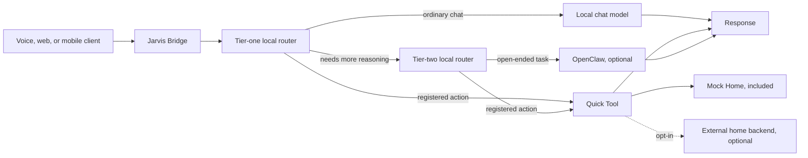

# Jarvis Home system overview

This diagram describes the public repository contract. It does not depict a private deployment, real device inventory, or bundled third-party services.

## Included in this repository

- Jarvis Bridge routing and execution ownership
- Capability registration, validation, promotion, rollback, and audit records
- Constrained Quick Tool planning
- Mock Home, which runs in memory without network or device effects
- A generic external-home client that is disabled by default
- Offline tests, package builds, clean-clone checks, and the release privacy guard

## Installed separately

Local model servers, OpenClaw, voice frontends, presentation layers, and real home platforms are optional external services. Jarvis Home does not download or start them automatically.

## Trust boundaries

1. Model output is untrusted input.
2. A request has one final executor.
3. Quick Tools can use only registered capabilities and catalog entries.
4. A failed Quick Tool does not silently escalate to a more privileged executor.
5. Real home access is opt-in and must remain disabled in tests and examples.
6. Private deployment data does not belong in this repository.

See [`architecture.md`](architecture.md) for implementation details and [`../OPEN_SOURCE_SCOPE.md`](../OPEN_SOURCE_SCOPE.md) for the publication boundary.
